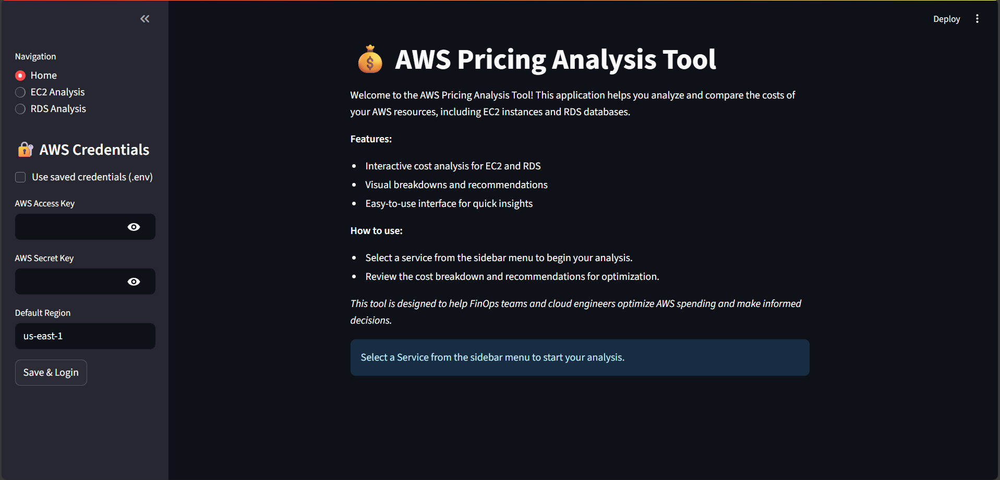
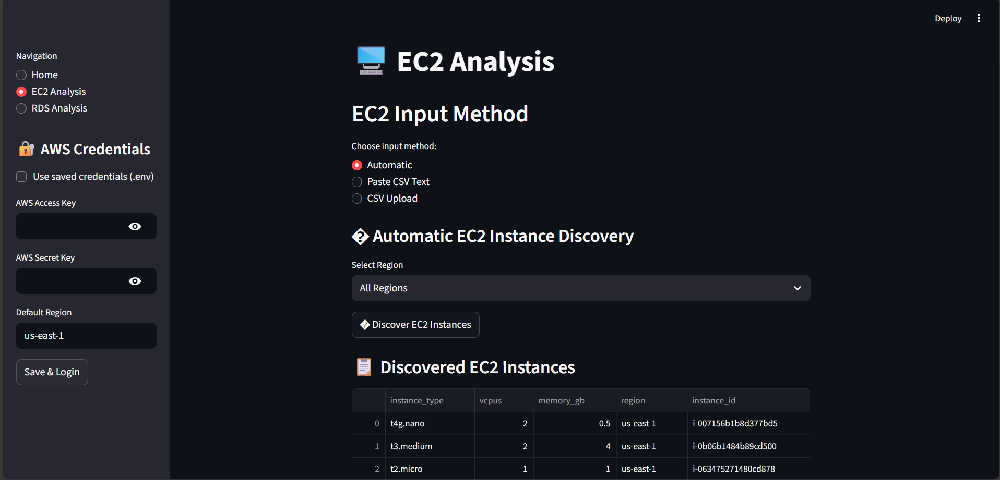
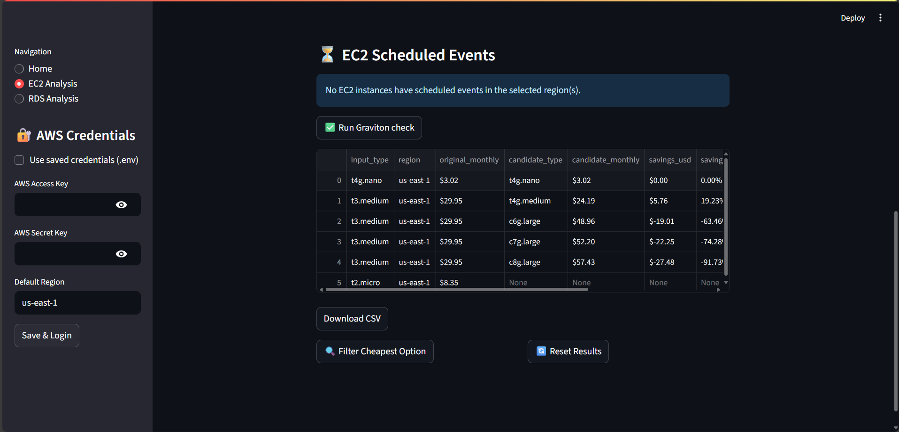
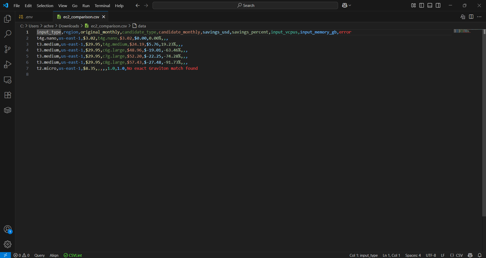
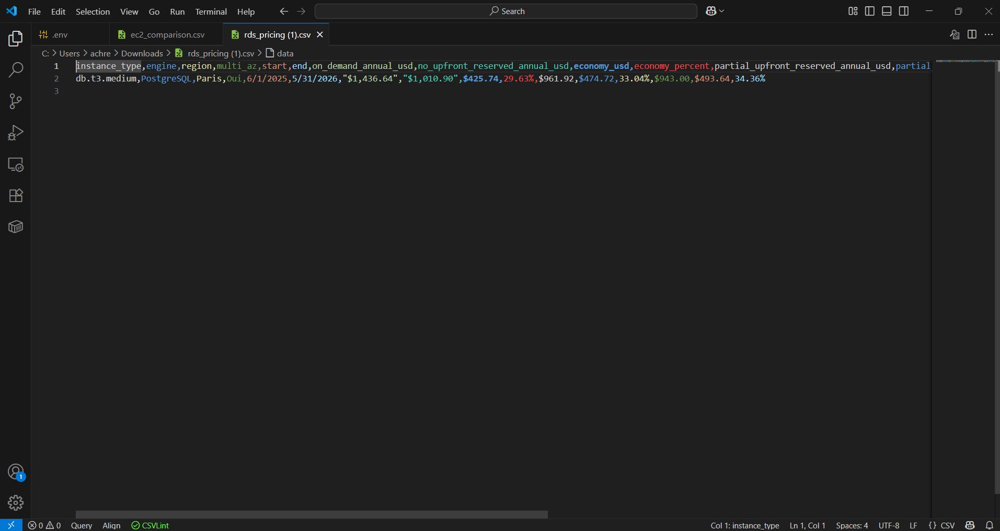
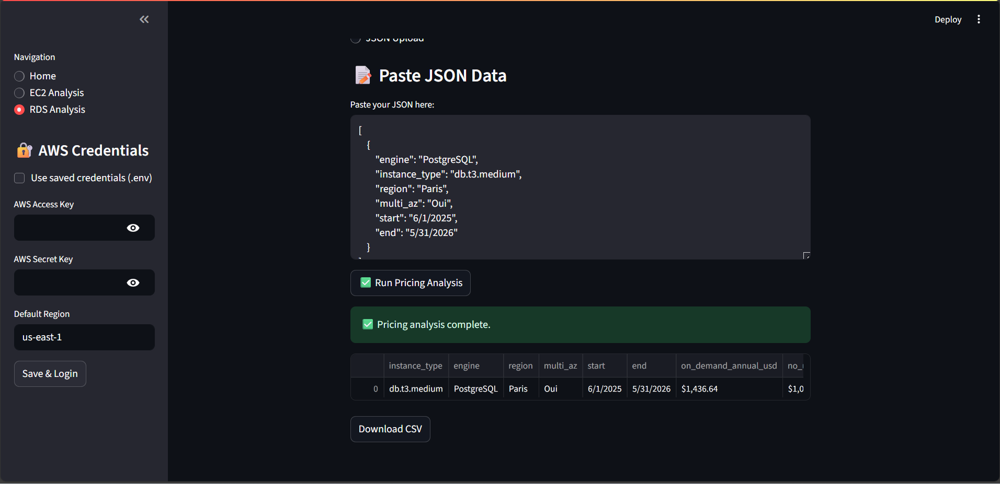
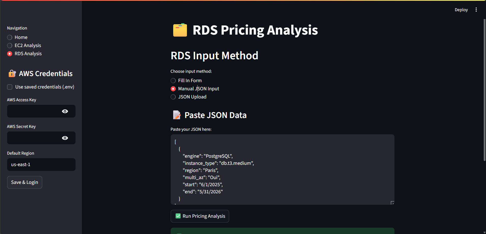

# FinOps Assistant (Streamlit App)


A Streamlit-based FinOps tool to optimize costs and manage workloads on AWS EC2 and AWS RDS. The app provides recommendations, pricing comparisons, and insights to support cloud financial operations (FinOps).

---


## Features

### Home Page
- Overview and navigation for all app features.
- Authentication sidebar for AWS credentials (.env or manual input).

#### Home Page Screenshot


### EC2 Analysis & Optimization
- Analyze active EC2 instances in your account.
- Suggest Graviton instance equivalents with matching vCPU and memory for cost savings.
- Display cost savings and highlight the cheapest Graviton options.
- Detect scheduled events (e.g., retirement notifications).

#### EC2 Analysis Screenshots




### RDS Reservation Insights
- Input RDS data via form, JSON upload, or manual entry.
- Specify start and end dates for reservations.
- Calculate all pricing scenarios:
   - On-Demand (no reservation)
   - Reserved Instances: No Upfront, Partial Upfront, All Upfront
- Show potential savings and compare all options.

#### RDS Analysis Screenshots




---

## Tech Stack
- [Python](https://www.python.org/)
- [Streamlit](https://streamlit.io/)
- [AWS SDK (boto3)](https://boto3.amazonaws.com/v1/documentation/api/latest/index.html)

---

## Installation

1. Clone the repo:
   ```bash
   git clone https://github.com/achref-soua/finops-assistant.git
   cd finops-assistant
   ```

2. (Optional) Create & activate a virtual environment:
   ```bash
   python -m venv venv
   source venv/bin/activate   # Linux / Mac
   venv\Scripts\activate      # Windows
   ```

3. Install dependencies:
   ```bash
   pip install -r requirements.txt
   ```

---

## Usage

1. Start the Streamlit app:
   ```bash
   streamlit run app.py
   ```

2. Open in your browser:  
   http://localhost:8501

---

## Project Structure
```
app/
├── app.py              # Main Streamlit app entry point
├── requirements.txt    # Python dependencies
├── README.md           # Documentation
├── .gitignore          # Ignored files (e.g., .env, __pycache__)
├── .env                # AWS credentials (not in repo)
│
├── app_pages/          # Streamlit page modules
│   ├── home.py
│   ├── ec2_analysis.py
│   └── rds_analysis.py
│
├── screenshots/        # App screenshots for documentation
│   ├── home.png
│   ├── ec2_discovery.png
│   ├── ec2_graviton.png
│   ├── graviton_output_sample.png
│   ├── rds_output_sample.png
│   ├── rds_pricing.png
│   └── rds_pricing_1.png
│
└── utils/              # Helper functions and modules
   ├── auth.py
   ├── helpers.py
   ├── models.py
   └── pricing.py
```

---

## Security
- AWS credentials are never stored in the repo.
- Use a `.env` file (already gitignored) to manage secrets safely.

---

## Contributing
Pull requests are welcome! For major changes, please open an issue first to discuss what you’d like to improve.

---

## License
This project is licensed under the MIT License.
